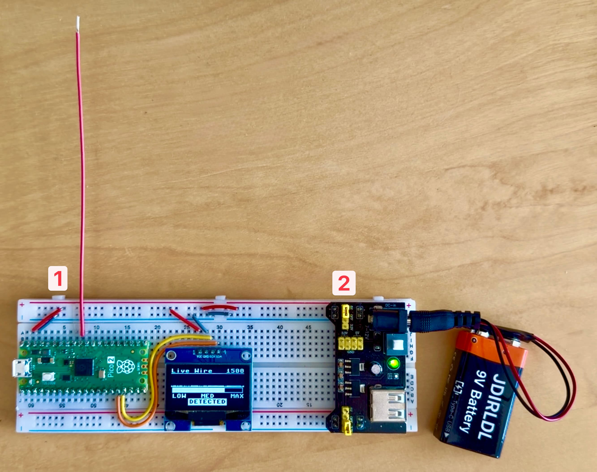

# Live-Wire Pico Sniffer

[](LICENSE)

**Let your Raspberry Pi Pico 2 find the live wires before your drill does!**

Non-contact AC voltage detector built on a Raspberry Pi Pico 2, an insulated copper jumper used as an antenna, and a 128×64 SH1106 OLED display. A short jumper wire on an ADC pin capacitively couples to the electric field around mains conductors, and the OLED shows a scrolling history strip plus a magnitude bar that spikes when the probe passes over a live wire.

> ⚠️ **Disclaimer.** This is a hobby project, not a certified non-contact voltage tester. Build, **calibrate** and use at your own risk. The author accepts no liability for damage, injury, or loss caused by use or misuse of this project.

> 🎯 **Calibrate before you trust it.** Sensitivity varies dramatically with antenna length, supply, and how you hold the board, so always start each session by sweeping over a spot you *know* is energized (e.g. a powered lamp's cord) and a spot you *know* has no wiring nearby (an open floor, the middle of a wooden door). That tells you what a real "DETECTED" looks like for your current setup — and, just as importantly, what the baseline noise looks like — before you point it at anything that matters.

## Hardware



Important points (marked in the image above):
1. Make sure you connect the power supply to the `VSYS` pin and NOT the `VBUS` pin. This way you can power the Pico both from the micro-USB connection and the power supply board.
2. Make sure you select the `5V` pins in the power supply board

For best detection sensitivity, prefer **battery power** (e.g. a single 18650 + holder, or 3×AA, into `VSYS` with USB unplugged). A floating supply gives the cleanest baseline; a mains-derived PSU couples 50/60 Hz hum onto ground and shrinks the contrast between "near a wire" and "free air." See [doc/features/live-wire-detection.md](doc/features/live-wire-detection.md) for details.

The antenna is a single insulated breadboard jumper (solid-core, 22 AWG). One end goes into the ADC pin; the other end is the probe tip. Stripping ~1–2 cm of insulation off the tip slightly increases sensitivity but is optional — the plastic jacket does not block capacitive coupling.

Wire the antenna and OLED to the Pico as follows:

| Signal           | Pin  | Device                       |
|------------------|------|------------------------------|
| ADC0             | GP26 | Antenna jumper (probe wire)  |
| I2C0 SDA         | GP12 | SH1106                       |
| I2C0 SCL         | GP13 | SH1106                       |

Devices: 

| Device | Bus  | I2C Address | Notes |
|--------|------|-------------|-------|
| SH1106 | I2C0 | 0x3C        | 128×64 OLED display |

I2C runs at 400 kHz.

See the [Raspberry Pi Pico pinout](https://pico.pinout.xyz/) for pinout details.

## Project layout

```
main.py                          # Entry point (runs on boot)
AGENTS.md                        # Project instructions (conventions, layout, deploy commands)
CLAUDE.md                        # One-line redirect to AGENTS.md
lib/
  sh1106.py                      # SH1106 OLED driver (I2C, framebuf-based)
  live_wire_sensor.py            # Windowed peak-to-peak ADC sampler
  live_wire_display.py           # OLED rendering: history strip + bar + DETECTED label
test/
  sh1106_test.py                 # On-device display test suite
  live_wire_sensor_test.py       # Prints peak-to-peak readings over serial
  live_wire_display_test.py      # Renders a static demo screen for photographing the OLED
doc/
  features/                      # Per-feature documentation (one Markdown file per feature)
```

## Deploying to the board

Use `mpremote` (install with `pip install mpremote`):

### Copy entire project to the board
```bash
mpremote cp -r lib/ test/ *.py :
```

### Copy and run a test file
```bash
mpremote cp test/<test_file>.py :test/ + run test/<test_file>.py
```

### Resetting the board
```bash
mpremote reset
```

## Running tests

Tests run directly on the Pico — there is no host-side test harness. Connect the board via USB and:

```bash
mpremote run test/live_wire_sensor_test.py    # Print peak-to-peak ADC readings
mpremote run test/sh1106_test.py              # OLED display test suite
mpremote run test/live_wire_display_test.py   # Render a static demo screen for photos
```

All test files have a `main()` entry point guarded by `if __name__ == "__main__"`.

`live_wire_display_test.py` does not sample the ADC. It pushes a single representative frame (low-noise baseline plus two simulated wire-pass humps, with the `DETECTED` box visible) and stops, then dims the OLED via `display.contrast(8)` so an iPhone's auto-exposure picks a long enough shutter to avoid the rolling-shutter banding you otherwise get against the panel's internal refresh.

## How the detector works

There is no IC sensor — just a piece of wire on an ADC pin. The principle is **capacitive coupling to the electric field** around an energized conductor:

```
mains conductor (50/60 Hz E-field)
        │
        │  capacitive coupling through air + insulation
        ▼
antenna wire ──→ Pico ADC0 (GP26) ──→ windowed peak-to-peak
                                              │
                                              ▼
                                  history strip + magnitude bar (SH1106)
```

A live wire radiates an electric field whether or not current is flowing — that is why this approach detects energized-but-unloaded wires (the ones you don't want to drill into). A coil/solenoid antenna would instead pick up the magnetic field, which only exists when a load draws current; it would also need many turns around a ferrite core to be useful at mains frequency.

**Signal path:**

1. The ADC samples GP26 at ~4 kHz for ~40 ms (≈ 2 cycles at 50 Hz, ~2.4 at 60 Hz).
2. The sampler returns peak-to-peak amplitude (`max - min`) — the amplitude of the induced 50/60 Hz signal on the antenna.
3. The display module auto-scales against a slowly-decaying running max, so the bar and history strip stay useful regardless of absolute signal level.
4. When the current reading exceeds half of the running max, the OLED shows `DETECTED`.

**Why peak-to-peak rather than RMS:** integer arithmetic, one min and one max per sample, no squaring or square-root, comfortably real-time in MicroPython on the Pico 2.

## Acknowledgements

- SH1106 driver and project layout reused from [pico-cardio](https://github.com/rafacm/pico-cardio).
- Built with [Claude](https://claude.ai).

## License

This project is licensed under the MIT License — see the [LICENSE](LICENSE) file for details.
